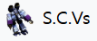
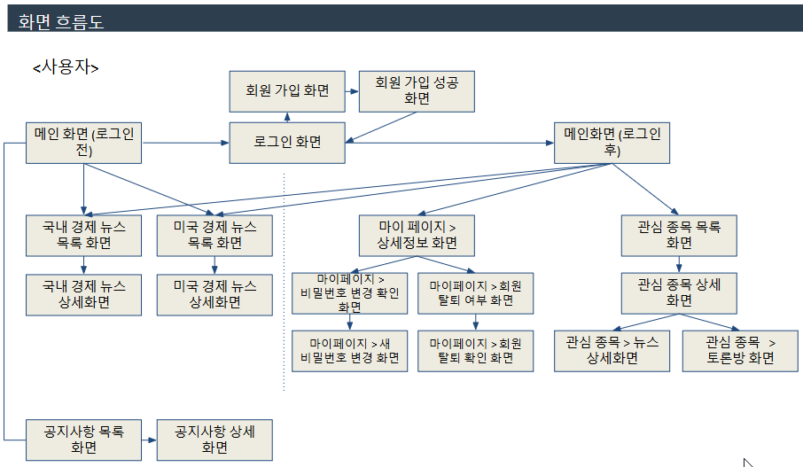

# S.C.Vs (Stocknews Collection Viewers)

<p align="center">  
  <br>
</p>

KDT 27회차 3조 팀 프로젝트입니다.

## 프로젝트 소개

S.C.Vs (Stocknews Collection Viewers)는 개인화 주식 종목 뉴스 플랫폼이란 주제로, 주식과 관련된 뉴스를 중점으로 정보들을 모아 보여주는 웹 페이지 입니다. 국내 경제 뉴스와 미국 경제 뉴스를 크롤링한 다음 번역과 가공을 통해 뉴스들을 보여주는 기능과 관심 종목에 대한 키워드 분석과 감정 분석을 하여 해당 주식에 대한 뉴스를 긍정/중립/부정으로 평가하여 보여줍니다. 또한 주식 정보와 주요 지표를 확인할 수 있으며 관심 종목에 대한 커뮤니티를 형성하여 의견을 나눌 수 있습니다. 

<br>

## 구성원

| 강민 | 하승우 | 이도훈 | 박범서 | 박주연 | 김건우 | 이기환 |
| :---: | :---: | :---: | :---: | :---: | :---: | :---: |
|  |  |  |  |  |  |  |
| [zzangkkmin](https://github.com/zzangkkmin) | [invisibleufo101](https://github.com/invisibleufo101) | [giveluck](https://github.com/giveluck) | [duddnr0514](https://github.com/duddnr0514) | [sw-jooyeon](https://github.com/sw-jooyeon) | [KGW-561](https://github.com/KGW-561) | [Lee-Gi](https://github.com/Lee-Gi) |


<br>

## 구현 기능

### 국내 & 미국 뉴스 크롤링

- 
- 국내 뉴스 사이트와 미국 뉴스 사이트에 있는 경제 / 주식 기사들을 크롤링
- 주식 종목 별 키워드로 분류
- 미국 뉴스의 경우 Papago Translation을 이용한 번역 작업
- 해당 주식에 대한 뉴스가 긍정

### 국내 & 미국 주식 정보 크롤링

- 한국투자증권 API를 활용한 국내 시장 지표(KOSPI, KOSDAQ), 미국 시장 지표(NASDAQ, S&P500), 원 달러 환율 정보 추출
- yFinance API를 활용한 국내/미국 주식 정보들 추출
- 추출된 지표 정보는 메인 페이지 및 국내/미국 뉴스 페이지에서 확인
- 추출된 주식 정보는 관심 종목 세부 페이지에서 확인

### 관심 주식 커뮤니티

- 사용자가 관심 주식을 선택한 다음, 그 주식에 대한 긍정/부정 투표 가능
- 관심 주식에 대한 댓글을 남겨 그 주식의 관심있는 다른 사용자와 함께 의견 공유

### 그 외

- 로그인 / 계정 정보
- 공지사항
- 관리자용 계정 관리

<br>

## 프로젝트 구조

### 프로젝트 구조도


### scvs (웹 프로젝트 구조)
```plaintext
scvs/
├── gradle/wrapper
├── src/
│   ├── main
|   |   ├── java/com/team3/scvs          
│   |   |   ├── config/                  # 스프링 설정 코드
│   |   |   ├── constant/                # 상수
│   |   |   ├── controller/              # 컨트롤러
│   |   |   ├── dto/                     # DTO
│   |   |   ├── entity/                  # 엔티티
│   |   |   ├── repository/              # 리포지토리
│   |   |   ├── security/                # 스프링 보안 설정
│   |   |   ├── service/                 # 서비스
│   |   |   ├── util/                    # 유틸
│   |   |   ├── ScvsApplication.java     # 어플리케이션 실행 코드
│   |   |   └── ServletInitializer.java  # 서블릿 초기화 파일
|   |   └── resources
|   |       ├── static
|   |       |   ├── css/                 # css 스타일
|   |       |   ├── images/              # 사용 이미지
|   |       |   └── js/                  # javascript
|   |       ├── templates
|   |       |   ├── Account/             # 사용자 로그인/로그아웃 html
|   |       |   ├── Admin/               # 관리자 html
|   |       |   ├── News/                # 뉴스 html
|   |       |   ├── PSA/                 # 공지사항 html
|   |       |   ├── Partials/            # html 조각 모음
|   |       |   ├── Stockwatch/          # 관심 종목 html
|   |       |   ├── User/                # 사용자 정보 html
|   |       |   ├── error/               # 에러 html
|   |       |   ├── layouts/             # 레이아웃 구성 모음
|   |       |   └── index.html           # 메인 페이지
|   |       └── application.properties   # 스프링 어플리케이션 설정 값
|   |
|   └── test/java/com/team3              # 테스트 코드 
|
├── .gitattributes                       # Git 설정 파일
├── .gitignore                           # Git 무시 파일 목록
├── build.gradle                         # gradle 빌드 설정 파일
├── gradlew                              # gradle 실행 파일
├── gradlew.bat                          # gradle 배치 실행 파일
└── settings.gradle                      # gradle 설정 파일
```
<br>

### 화면 흐름도

<br>

### API EndPoint Lists
[API_ENDPOINT_LIST](API_endpoint_list.md)

## 기술 사용 스택

- Backend:   
    

- DB  
   

- FrontEnd:  
      

- Design:  
  

- Crawler:  
  

- IDE:  
    

- Version Control:  
   

- 네이버 클라우드 서비스:  
  Cloud DB for MySQL(DB), CLOVA Studio(감정분석), Papago Translation(번역)

- API:  
  한국투자증권, yFinance


## 역할 분담

|  |  |  |
|-----------------|-----------------|-----------------|
| 강민 |   | <ul><li>프로젝트 계획 및 관리</li><li>GIT 최종 관리자</li><li>메인 페이지 및 레이아웃 구성</li><li>주식 정보 및 지수 정보 크롤링</li></ul>     |
| 하승우 |  | <ul><li>파이선 크롤러 담담</li><li>DB 설계자</li><li>국내/미국 뉴스 크롤링</li><li>키워드 추출 및 분리</li></ul> |
| 이도훈 |      | <ul><li>기사 감정분석 적용</li><li>DB 설계자</li><li>토론방 페이지 디자인</li><li>토론방 백앤드 기능 담당</li></ul> |
| 박범서 |   |<ul><li>공지사항 페이지 디자인</li><li>공지사항 백앤드 기능 담당</li></ul>  |
| 박주연 |      | <ul><li>국내/미국/관심주식 뉴스 페이지 디자인</li><li>국내/미국/관심주식 뉴스 부분 백앤드 기능 담당</li></ul>    |
| 김건우 |      | <ul><li>회원가입/로그인/로그아웃/계정정보/관리자 페이지 디자인</li><li>회원가입/로그인/로그아웃/계정정보/관리자 백앤드 기능 담당</li></ul>    |
| 이기환 |      | <ul><li>관심주식 페이지 디자인</li><li>관심주식 백앤드 기능 담당</li></ul>    |

<br/>

## 프로젝트 기간

2024/11/04 ~ 2024/12/17 (6W, 2days)

| week 1 | week 2 | week 3 | week 4 | week 5 | week 6 | week 7 |
|--------|--------|--------|--------|--------|--------|--------|
|기획    |         |       |        |        |        |        |
|        |설계     |       |        |        |        |        |
|        |         |구현   |구현     |구현    |        |        |
|        |         |       |        |        |테스트  |        |
|        |         |       |        |        |        |완성    |

## 작업 과정

### GIT 전략

- 개발 시 `main` 브랜치에서 파생된 `develop` 브랜치를 기반으로 작업한다.
- `develop` 브랜치에서 `features/` 에 미리 정의한 기능 ID로 브랜치를 나누어서 작업한다.
- `features/[기능ID]` 에서 기능 개발이 완료한 뒤 github에서 `pull-request`를 보낸다.
- `pull-request`를 보내면 보낸 이를 제외한 최소 1명이 github에서 보낸 pull-request 내용을 본 후 **허용**을 해야 `merge pull-request`가 될 수 있다.
- `merge pull-request` 시 **충돌이 발생**한 경우 github에 나와있는 가이드라인을 따라 `develop`을 pull한 다음에 pull-request 대상 브랜치로 체크아웃해서 pull된 `develop`을 머지하여 충돌을 해결한 다음, `merge pull-request`를 실행한다.
- 테스트 도중 나온 오류에 대한 브랜치는 `bugfix/` 에 테스트 ID로 브랜치를 나누어서 오류를 해결한 다음 `pull-request`를 보내서 `develop`에 반영한다.
- commit을 남길때 형식은 `[기능/테스트ID] 주요내용` 으로 남기고 부가적인 내용은 commit 세부 내용에 담는다.
- 최종적으로 개발된 `develop` 브랜치는 `main`으로 반영하여 개발을 완료한다.


## 이것은 좋았다...

### 철저한 GIT 관리
- 팀 프로젝트인 만큼 GIT 규칙 및 양식 등 사전에 협의하여 실제 작업와 비슷하게 개발 과정을 관리했다.
- 거의 모두가 GIT을 처음 사용을 했지만, 모두가 규약을 설계하고 철저히 지키며, 예상치 못한 충돌에는 git 경험자의 빠른 피드백 서비스로 조치하며 원할한 개발 흐름을 유지했다.

### 배운 과정 외 기술 탐색 및 활용
- 교육 과정 중 배운 Mybatis, el표기법 외 JPA 적용과 타임리프 활용법 그리고 파이선을 이용한 크롤링을 활용하면서 과정 외 기술들을 분석하고 사용하는 방법을 익혀서 개발할 수 있었다.
- 과정 외 기술들을 잘 활용한 결과 프로젝트 구조 구축과 개발 편의성 향상에 큰 도움이 되었다. 

### 우리 프로젝트만의 Kick
- 주제가 주식 뉴스 데이닝 마이닝인 만큼, 기존 스프링 구조와 별개로 크롤링만을 위한 프로젝트를 따로 두어서 관리하였다. 즉 스프링 실행 작업과 크롤링 실행 작업을 따로 두는 구조로 개발하여 서로 독립적으로 관리할 수 있다.
- 크롤링 과정에선 주기적으로 정보를 긁어와 DB에 넣어주는 작업만 담당하고, 스프링 과정에선 사용자 요청에 따라 정보르 DB에서 읽어오는 작업만 담당하게 구성하였다.

## 이건 좀 아쉬웠다...

### 누구나 그럴싸한 계획을 가지고 있다, 실전을 접하기 전까지는...
- 개개인의 역량을 고려하면서 계획을 짯었으나... 실전은 계획대로 흘러가지 않았다.
- "배운대로 하면 된다"란 생각은 예외 상황 및 돌발 상황 대처에  
<br>


# 여기서 부턴 개인 평(리드미 포함 X)

# 강민님
- 백지장도 맞들면 낮다인가, 사공이 많으면 배가 산으로 가는가인가.

# 박범서님
- 수업 도중 학습했었던 기본에 충실하고 싶었기에 CRUD 구현이라는 목적에 가장 어울리는 파트를 맡았다. 배운대로만 하면 된다는 생각에 꽤나 빨리 끝날 것이라 예상하고 있었는데, 안타깝게도 현실은 그렇지 못했다. 자바 코드에서 오류가 생기는 건 당연하고, 전혀 예상치도 못하게 화면 디자인 쪽에서도 계속해서 구멍이 생기는 판에 예상 시간보다 질질 끌리는 상황을 피할 수가 없었다. 다 완성되었다고 생각한 기능조차도 제 3자가 보기에는 불편한 오류들이 군데군데 있었기에 수정에도 상당한 시간이 소요되었다. 결국은 공지사항 관련 기능 완성에 거의 모든 시간을 소요했다.

git 관련에서도 꽤나 많은 고생을 했는데, 팀 프로젝트용 github 사용이 거의 처음이다보니 갈피를 못 잡고 이것저것 헤메게 되었다. 다행히도 브랜치 오사용이나 잘못된 머지로 팀원들의 작업물을 날려먹는 대참사는 일어나지 않았지만 도중에 pull 실수로 내 작업을 날려먹는다던가... 꽤나 많은 일이 있었다. 그래도 이 부분에서는 조장인 강민님이 깃 관리를 철저히 해 주신 덕에 더 꼬이는 일 없이 원활한 해결이 되었다고 생각한다. pr시에도 원인 모를 충돌을 해결한다고 꽤나 끙끙댔었는데, 도훈님의 도움 덕에 빠르게 해결할 수 있었다. 이번에 작업을 하며 데여 본 경험 덕에 다음부터는 좀 더 원활한 작업이 가능하지 않을까 생각한다.

상술했듯 많은 문제들이 생겼었던 프로젝트였으나, 그간의 학습 내용을 총망라해서 되돌아볼 수 있는 좋은 시간이었다. 귀중한 팀 프로젝트 경험을 쌓을 수 있었다는 점 또한 좋은 부분이다. 시작부터 꽤나 삐걱대는 소리가 났지만 이런 상황에서도 끝까지 포기하지 않고 달려와준, 힘들 때 도와 준 팀원들에게 감사할 따름이다.

# 이기환님
느낀점: 이번 프로젝트를 시작하기 전부터 스프링부트 학습이 부진하여 내가 모자란걸 알고 있었지만, 실제로 다른 분들과 프로젝트를 해보니 생각보다 부족한 부분이 더 많다는걸 알 수 있었다. 같은 강의를 들은 다른 사람들과 비교해 볼 수 있는 좋은 기회였던거 같다.


 그리고 대부분 다른 조원분들이 완성했지만 프로젝트가 완성되어가는 모습을 볼 때, 혹은 작은 부분이라도 내가 한 부분이 완성된걸 보니 뿌듯했다.
 만들어지는 과정중에 제대로 수행 가능한 부분이 적어서 많이 의존했고, 도움을 받았는데 상당히 미안한 마음이 들었다. 다음에는 이런 상황이 없도록 좀 더 정진해야겠다고 느꼈다.


나는 피그마를 통해 디자인된 몇몇 화면을 구현하는 역할을 맡게됐다. html, css 등을 활용하여 화면을 구현하면 그 화면을 조원분들이 받아서 수정 후 활용하는 방식이었다.
개인적으로 해당 화면을 gpt를 이용해 큰 틀을 짜고, 거기에 내가 살을 덧대거나 부분적으로 프로젝트에 맞게 수정하면 될거라고 생각했는데,
화면마다 사이즈가 다르기 때문에 반응형도 고려해야했고, gpt가 만들어준 코드가 생각보다 부실하여 개인적으로 공부가 필요했다.
결국 원하는 부분을 gpt에게 묻고, 그 부분을 책을 보고 공부하면서 화면을 구하는 방식으로 해결할 수 밖에 없었다. 그럼에도 사소한 문제를 일으켜서 팀원들에게 미안했다.
문제를 해결하려 해도 실력의 문제이니 당장 해결이 불가능할 거라고 생각해서, 많은 주석을 달다보니 또 생각보다 시간이 많이 필요하게 됐다.
왜 강사님이 주석다는 버릇을 중요하게 여기셨는지 몸으로 느낄 수 있었다.
그리고 눈으로 보고 코드를 해석하는것과 실제로 만드는것의 난이도 차이가 생각보다 너무 크다는 것도 느꼇고, 강의 초반부에 게을러서 강사님이 권장해 주신 학습을 하지 않은 점이 아쉬웠다.


프로젝트를 하면서 생각하지 못한 부분에서 어려움을 느낀점이 있었는데, 깃허브 사용이 생각보다 많이 복잡했다.
 처음에 설명을 들었을때는, 스테이지에 올리고 커밋만 하면 되는 단순한 시스템이라고 생각했는데,
 실제로 사용해보니 자칫 잘못하단 충돌이 일어날 수도 있고 merge, check out, pull up 등 기능도 많이 존재헤서,
 공부를 간략하게라도 하지 않으면 사용 할 수도 없었다. 


문서 작업이 생각보다 너무 많다고 생각했는데, 직접 프로젝트를 해보니 정말 필요한 부분이라고 생각됐다.
개인적으로 문서화가 됐는데도 실수한 부분이 있었고, 문서가 없었으면 더 많은 실수를 했을거라고 생각한다.
여러명이 함께 작업을 한다는 점에서, 사람들을 묶어주는 문서가 없으면 의사소통부터 명확히 되지 않았을 것이라는 생각이 든다.

그리고 피그마를 통해 설계 및 디자인을 직접해보고,
 html을 통해 디자인된 화면을 구현하는 과정에서 개인적으로 불명확했던 프론트, 백엔드, 디자인의 차이를 확실하게 알게된거 같고, 그 차이를 알게 되니 왜 회사에서 다른 영역으로 분류해서 채용하는지, 왜 여러 사람들이 한 분야를 깊게 파야한다고 하는지 느낄 수 있었다.

이번 프로젝트를 통해 내가 부족하단 점을 여실히 느낄 수 있었고, 예상못한 문제나 의아했던 부분등 직접 해보지 않고는 알 수 없던 부분들을 배워간거 같습니다.
프로젝트를 거름삼아 공부하여 다른 조원분들의 코드를 이해하고 스스로 구현할 수 있게 하고, 개발자의 길에 한 걸음 더 나아가도록 하겠습니다.

# 이도훈님
DB 설계
토론방 기능 구현
다른 페이지 기능 지원
설치 가이드 일부 작성

느낀점
이번 프로젝트에서 가장 도전적인 부분은 아무것도 없는 상태에서 DB를 설계하는 것이었습니다. 테이블을 정의하면서 다른 테이블과의 관계, 각 열의 특성, 그리고 정규화 같은 여러 가지를 고민해야 했기에 초기에는 상당히 어렵게 느껴졌습니다. 하지만 혼자 하는 작업이 아니라 팀 프로젝트였기 때문에, 팀원들과 아이디어를 공유하고 논의하며 어려운 부분을 해결할 수 있었습니다.

백엔드 개발에 관심이 많았던 저는 토론방 기능을 직접 구현하기로 했습니다. 처음 도전하는 개발인 만큼 CRUD 전부를 포함하는 기능을 완성해 본다면 다른 부분도 쉽게 다룰 수 있을 거라 생각했습니다. 이 과정에서 처음으로 Thymeleaf와 JPA를 사용했는데, 제가 설계한 기능이 처음 작성한 DB 구조와 잘 맞지 않아 코드와 DB를 다시 설계하고 정리하는 과정이 필요했습니다. 그럼에도 불구하고 계속 학습하고 작업을 진행한 결과, 실력이 늘었음을 느꼈고, 다른 페이지 기능 구현에도 기여할 수 있어 뿌듯했습니다.

또한, 팀 프로젝트에서의 Git 관리는 새로운 경험이었습니다. Git 브랜치 관리는 익숙하지 않아 처음에는 낯설었지만, 팀원 중 강민 님이 브랜치 관리 체계를 잘 정리해 주신 덕분에 큰 어려움 없이 Git을 활용할 수 있었습니다.

이번 프로젝트를 통해 백엔드 개발의 프로세스와 진행 방식을 배울 수 있었습니다. 무엇보다 개발하고자 했던 기능들을 모두 완성하며 뜻깊은 시간을 보낼 수 있어 매우 만족스러웠습니다.

# 김건우님
역할 : 로그인 및 회원가입, 회원정보 수정, 관리자-사용자관리 화면 및 기능 구현

느낀점 
처음에는 프로젝트의 주제도 생소했고 기능들의 이해가 부족한채로 시작하다보니 무엇을 할 수 있을지 확신이 없어 기본적인 기능을 맡았고 역할분배에 소극적으로 나선게 아쉬웠습니다. 새로운 팀과 수업때는 다루지 않았던 기술들을 적지 않게 사용하다 보니 어려운점도 많았고 실제로 다른 사람과의 소스코드 병합을 하는건 처음이기에 실수도 많았습니다. 
하지만 좋은 팀원들과 팀장님을 만나 깃(Git) 관리, 코드 관련 지식, 다양한 도구 사용법 등 부족했던 점들을 많이 배울 수 있었습니다. 깃관리를 실수해보니 깃관리의 중요성을 알았고 다른 팀원의 코드를 보니 제 코드의 부족했던 점과 주석, 변수명등 다른사람이 보는것도 고려해야하는 중요성을 배웠습니다. 또한 계획적인 진행에 제 역할에 온전히 집중할 수 있었고 목표를 달성해서 프로젝트를 완수할 수 있었던 점이 좋았습니다. 이번 경험은 저에게 팀협업와 기술적 성장 모두에서 큰 의미가 있는 시간이었습니다.

# 하승우님

느낀점:
선택과 집중

프로젝트 기획 단계에서 여러 기능들을 구현하고 싶었고 3주라는 짧은 시간 내에 구현할 수 있다고 믿었지만 막상 개발에 집중하다 보니 그 당시에 미처 생각하지 못했던 애로사항들과 문제점들이 있었고 왜 강사님과 멘토님들이 기능 수를 줄여라고 했는지 이해가 되었습니다. 기능 하나만 놓고 보면 구현하는데 문제가 없었지만 각기 다른 여러 기능들을 하나처럼 차질 없이 실행되도록 만드는 과정이 어려웠고 실수도 많았습니다. 전체 프로세스 스케줄링도 "간단하게 라이브러리만 써서 구현하면 되겠지"라는 안일한 생각으로 접근했다가 제가 쓰는 라이브러리들이 기반한 기술들을 정확히 몰라서 많은 시행착오를 겪었습니다. 

기획 단계에서 구현하지 못한 기능들도 있었고 현재 개발한 기능들도 저의 이상과 조금 동떨어진 감이 있습니다. 하지만 DB 설계 단계에서 고민하던 정규화/비정규화의 전략과 여러 API들의 특징들과 비동기 처리의 대한 방식으로 조금 실력이 향상된 것 같습니다.

비록 제가 프로젝트를 시작했을 때 생각했던 방향의 개발은 아니였지만 데이터베이스와 여러 API들을 접하면서 이 둘에 대해 집중적으로 파헤쳐보고 싶다는 생각도 들었습니다.

마지막으로 프로젝트를 열심히 수행해주시고 제가 고민하고 있을 때 도움을 주신 팀원분들 그리고 전체 프로젝트를 매끄럽게 리드하신 팀장님께 감사드리며 좋은 팀을 만나 운이 좋다고 생각합니다.

# 박주연님
<느낀점>
이번 프로젝트를 통해 정말 많은 것을 배웠습니다. 우선, 학교에서 이론으로만 익혔던 내용을 실제 프로젝트에 적용하고 문서화하면서, 실무 프로젝트가 어떻게 진행되는지 체감할 수 있었습니다. 이를 통해 앞으로 또 다른 팀 프로젝트를 진행할 때 어떤 방식으로 설계하고 접근하면 좋을지 방향을 잡을 수 있을 것 같습니다. 또한 Git을 단순히 push 용도로만 사용하던 이전 경험에서 벗어나, 이번에는 다양한 브랜치와 PR을 적극 활용하면서 Git 활용 능력을 한층 높일 수 있었다고 생각합니다. 마지막으로, 팀원분들이 모두 본인의 자리에서 최선을 다하시는 모습을 보고, 저도 같이 자극받고 팀원분들의 자세나 기술을 보고 배울 수 있었던 좋은 기회였습니다.

개인적으로 아쉬웠던 점이 있다면, 기능 구현에만 급급해 클린 코드에 대한 고려가 부족했다는 것입니다. 여러 가지 구현 방식 중에서도 각 방식의 장단점을 제대로 파악하고 나의 의도에 맞춰 코드를 작성하는 것이 핵심임을 다시금 깨달았습니다. 프로젝트 기한은 끝났지만, 앞으로 코드를 보완하면서 클린 코딩을 실천해보려 합니다. 또 다른 아쉬움은 나의 업무를 빠르게 끝내고 팀원들에게 도움을 주고자 했던 제 결심을 지키지 못했다는 점입니다. 아직 자바와 자바스크립트 역량을 더 높여야 할 필요가 있음을 느꼈고, 팀원들이 난관에 부딪혔을 때 함께 고민하고 해결책을 모색할 수 있는 개발자로 성장하고 싶다는 생각이 들었습니다.

앞으로도 이번 경험을 토대로 계속 성장해 나가며, 더 원활한 협업 환경을 만드는 데 기여하고 싶습니다. 무엇보다 프로젝트를 무사히 마칠 수 있도록 함께 최선을 다해주신 팀원분들께 진심으로 감사드립니다.


### 멘토 팁
냅킨 에이아이
각자 어느정도 비율을 했는가(기여도)
개인적인 작업은 노션으로 썰로 남겨라
완성... 흠... 이 어플리케이션에 대해서 자신이 있나? 객관적으로 측정해서 포장을 해봐라
2주정도는 다듬으면 좋겠다
전체적으로 잘하셔씁니다

피드백 어느정도 수렴해서 마무리까진 좋습니다.
그러나 정리를 본인것만 생각하지 말구 다른 이들까지 생각해보세요.
특히 **타인의 코드를 살펴보시길 강추**합니다.
최소한 이게 왜 동작되는지 소스/프로그램/흐름을 파악해주시면 좋겠습니다.

+ 멘토링 초기에 했던 이야기이지만, 계획이 엎어지는 경우가 많습니다.
  => 정석대로 잘 가던대로 마무리 정리하고 끝나고도 쫌더 보완해서 가져가는 것도 좋습니다.

리드미: 프로젝트에 관련 파일 / 따로 평가는 안 넣어도 됨 / 글은 적게, 도식화는 추천 / 굳이 모든 정보를 넣을 필요는 없고 / 메시지를 간단하게 붙이는게 리드미

포폴: 

## 전처리/후처리
전처리(데이터 정리) + 후처리(데이터 가공) = Extract T Load (?)
API to DB / processing DB data  
kafka publishing consuming ?